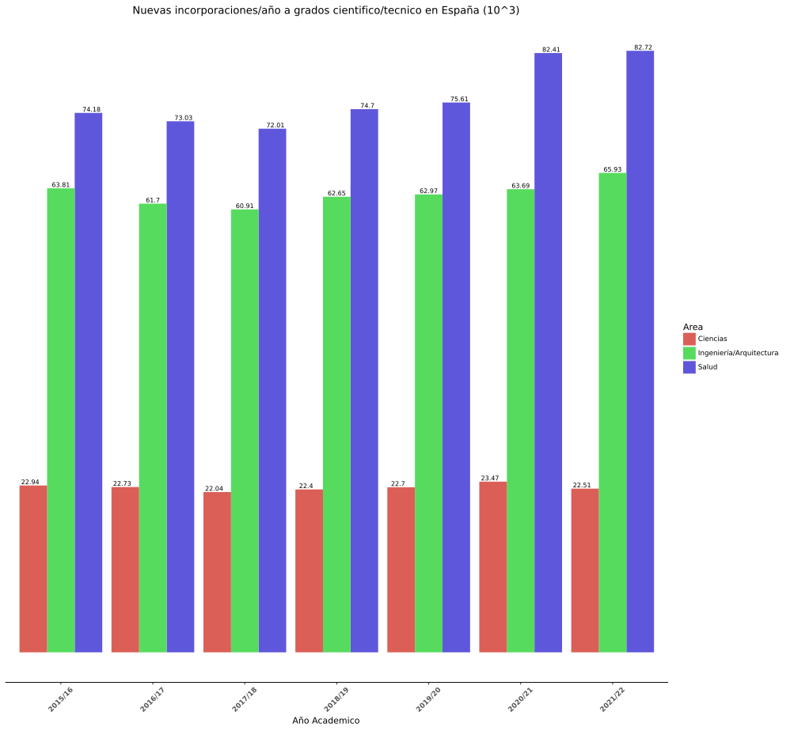
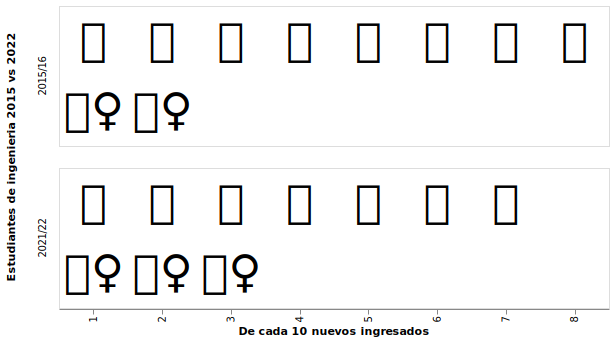
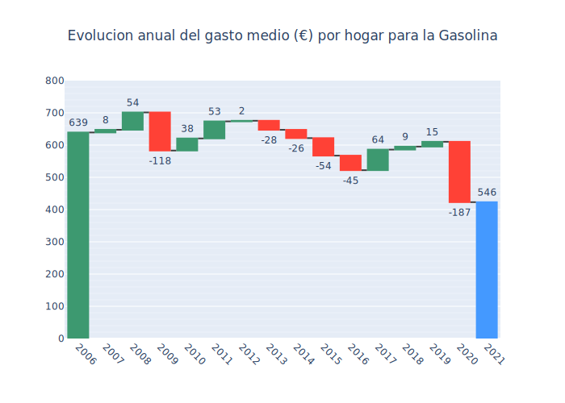

## A5: Estudio de técnicas de visualización de datos (PEC2)
Código y visualizaciones creadas para la resolución de la PEC2 de la asignatura Visualización de datos, Clase M2.859, Universidad abierta de Cataluña.

<b>Alumno</b>:Agustín Rovira   
<b>email</b>: arovirarovi@uoc.edu

<b>Enunciado</b>   
En esta actividad el estudiante  tendrá que crear tres pequeñas visualizaciones usando técnicas diferentes que le serán asignadas. Cada estudiante tendrá que escoger unos datos idóneos para cada una de las técnicas propuestas y decidir con qué software las crea

<b>Visualizaciones</b>   
-Bar chart    
-Isotype & Unit charts    
-Waterfall Chart      
 
 
<b>Solución</b>
Para la creacion de las visualizaciones se han seleccionados 2 dataset pertenecientes a de <A HREF="https://datos.gob.es/es/">datos abierta del gobierno </A>:
- <A HREF="https://datos.gob.es/es/catalogo/e05073401-estudiantes-de-nuevo-ingreso-en-grado-por-sexo-grupo-de-edad-y-rama-de-ensenanza">Estudiantes de nuevo ingreso en Grado por sexo, grupo de edad y rama de enseñanza</A>
- <A HREF="https://datos.gob.es/es/catalogo/ea0010587-gasto-por-codigos-de-gasto-5-digitos-ecoicop-anual-nacional-encuesta-de-presupuestos-familiares-epf-identificador-api-248851">Gasto por códigos de gasto (5 dígitos ECOICOP)</A>

La descarga, procesamiento y visualizacion de los datasets se hizo usando python, el codigo para la creacion de las 3 visualizaciones se puede encontrar <A HREF="./PEC_Visualizacion de datos.ipynb">aqui</A>

### Primera imagen   
Un diagrama de barras, es una forma de representar gráficamente un conjunto de datos o valores mediante barras rectangulares de longitud proporcional a los valores representados. Los gráficos de barras pueden ser usados para comparar cantidades de una variable en diferentes momentos o diferentes variables para el mismo momento

Para esta visualizacion usamos el primer dataset, donde obtenemos el numero de nuevos ingresos a carreras cientificas en España a lo largo de los ultimos 6 años. La comparacion se ve que para las 3 principales ramas, donde siempre hay mas profesionales es en el area de la salud con 82.720 ingresos en el 2022 (los datos estan en escala 103).

Para la creacion de la figura 1 usamos las librerias de <A HREF="https://plotnine.readthedocs.io/en/stable/#">plotnine</A>, que proporciona una sintaxis parecida a R.

  
  <em>Figura 1. Ingresos anuales de estudiantes a grados cientificos en España</em>

### Segunda imagen   
Unit charts/Isotype, los diagramas de isotipos son una combinación de lenguaje visual que enfatiza los datos cuantitativos con un simbolismo que a menudo se asocia con imágenes descriptivas.

Para esta visualización, usamos también el primer dataset. Donde se extrajo el número de estudiantes que ingresaron a una carrera de ingeniería para el año 2015 y el año 2022. Posteriormente separamos ambos grupos por sexo y se calculó el porcentaje de ingresos en cada año. Para hacer más fácil la comparación se expresó el porcentaje en términos de 10 unidades.

Para la creación de la figura 2 usamos las librerías de <A HREF="https://altair-viz.github.io/index.html">Vega-Altair</A>

  
  <em>Figura 2. Estudiantes de ingenieria 2015 vs 2022</em>

### Tercera imagen
Un gráfico de cascada es una forma de visualización de datos que ayuda a comprender el efecto acumulativo al introducir valores positivos o negativos de manera secuencial.

Para esta visualización se usó el segundo dataset. Se extrajo la evolución del gasto por hogar para la gasolina. En la creación de la figura 3 usamos las librerías de <A HREF="https://plotly.com/python/">plotly</A>

  
  <em>Figura 3. Evolución anual del gasto medio (€) por hogar para la Gasolina</em>

